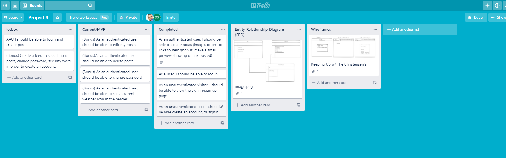
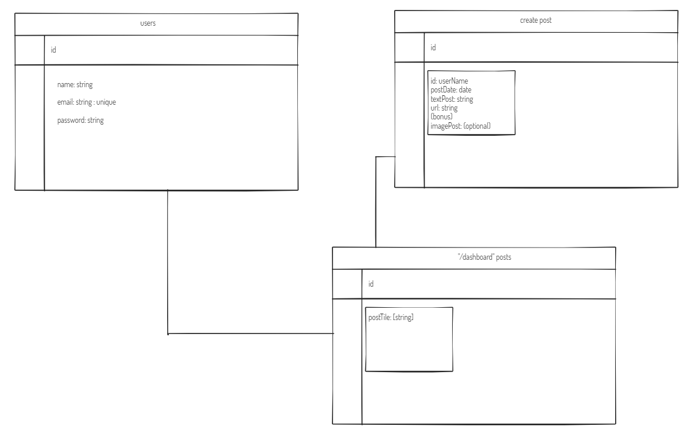
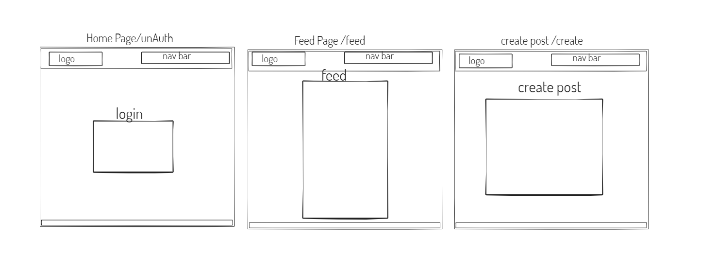
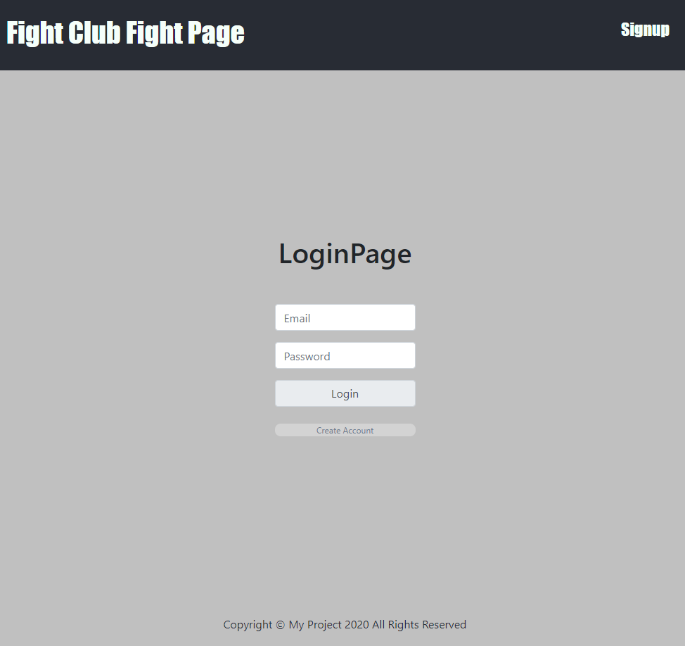
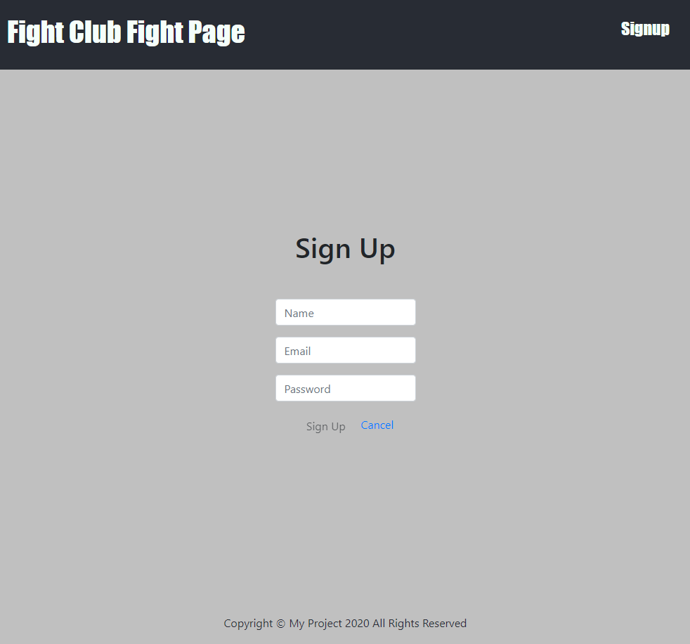
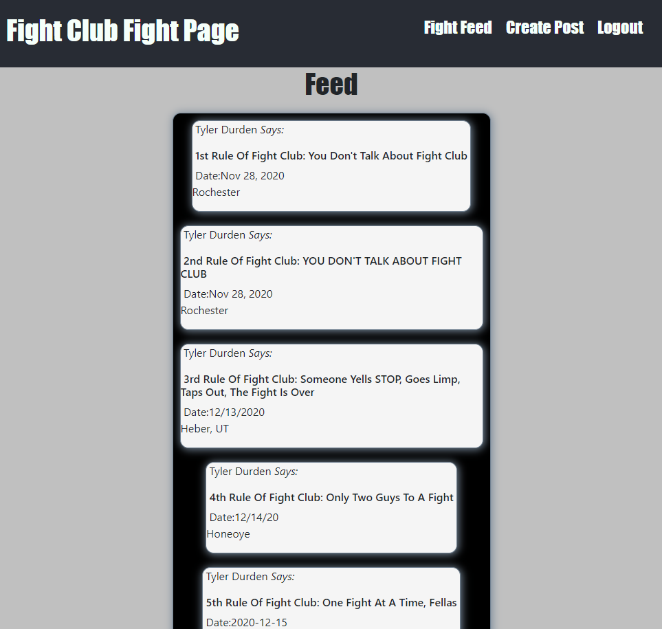

# Fight Club Feed
a simple web application where you can post your thoughts, as well as see the members in your groups posts

## Technologies Used
* React.js
* Jquery
* HTML 5
* CSS3
* JavaScript
* Node.js
* Express
* Bootstrap
* Mongoose/MongoDB
* Trello Board
* Wireframe
* ZiteBoard
* Heroku

## Screenshots

# Trello

# ERD

# WireFrame

# Screenshots

### Getting started
<a href="https://p3-frontend.herokuapp.com/">Click here to see the deployed app!</a>

### Future Items
Future Enhancements
user profile page
enable the user to comment and react to posts
post videos, pictures, etc.
enable user to save a movie/show as favorite.

#### Explanation
used React.js to make a SPA. in order to make the app more response without refresing. used components to structure and style the entire page.

used Express.js, mongoDB and mongoose to set up my database. users are able to register and save their information in the DB. passwords are encrypted and Salted.

Approach
-I use the trello board to design the approach a user would take once inside the app. I was able to design it with a wireframe. With those two ready I was able to move forward with my React.js and Express.js to input my functionalities. following the wireframe design i was able to stylized my page according to how i planned.

